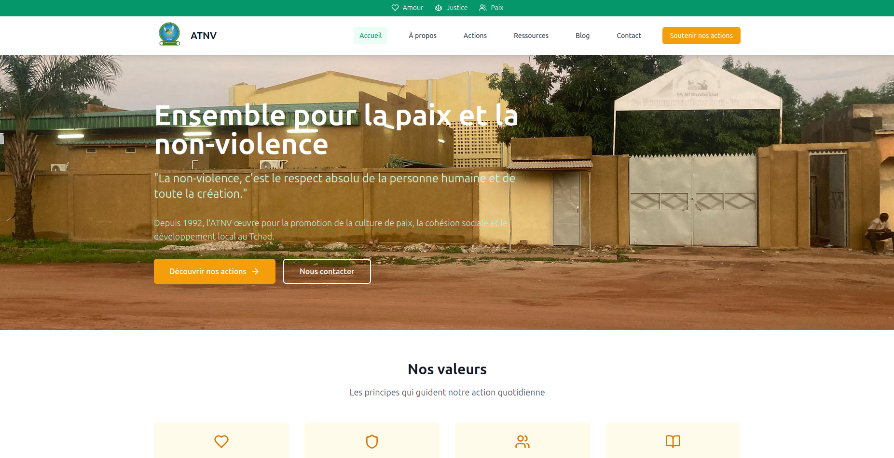

# ATNV_SITE

Création du site web pour l'Association Tchadienne pour la Non-Violence (ATNV)

Le site officiel de l’Association Tchadienne pour la Non-Violence (ATNV) est une plateforme d’information, de sensibilisation et de mobilisation en faveur de la paix et de la gestion non-violente des conflits au Tchad.

Il présente les actions de l’association dans les domaines de la médiation, de la formation à la non-violence, et de l’accompagnement communautaire, aussi bien dans les milieux scolaires, associatifs que gouvernementaux.

À travers des ressources pédagogiques, des témoignages de terrain, et des actualités, le site vise à renforcer l’engagement des citoyens et des institutions dans la promotion d’une culture de paix durable.

---

## 🚀 Technologies utilisées

- **React + Vite**
- **GitHub Pages** (hébergement gratuit)

---

## 📸 Capture d'écran

Voici un aperçu de l’interface de notre site pour l’ATNV :

